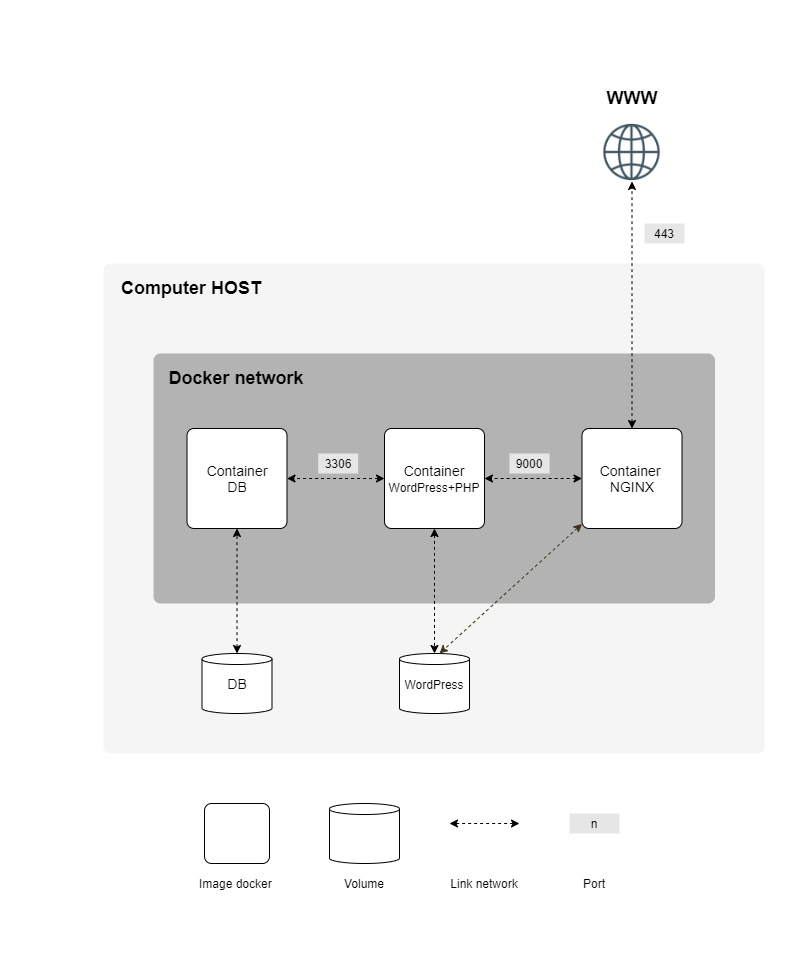

# Inception

#### System Administration exercice

 
 

 
 

## About

This project is the first Docker project of the [42 School](https://42.fr/en/homepage/) Common Core. This project consists in having you set up a small infrastructure composed of different services under specific rules.

## Services

- [Nginx](https://www.nginx.com/)
- [Wordpress](https://wordpress.com/)
- [MariaDB](https://mariadb.org/)

