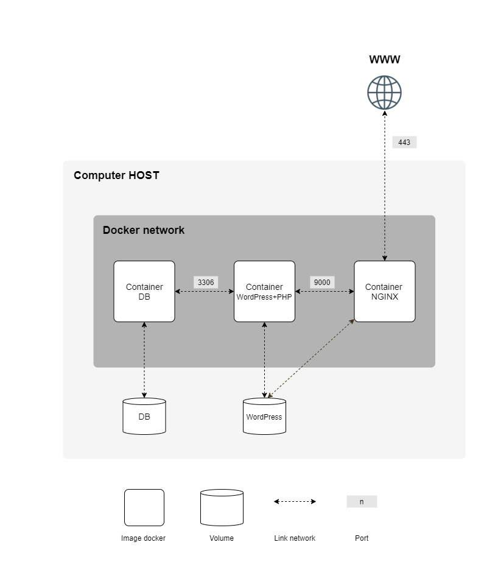

<div align="center">

# Inception

#### System Administration exercice

https://github.com/RhesusP/Inception/assets/58002704/9bf024fd-db1b-4375-a533-65a1d862ace0

</div>

## About

This project is the first Docker project of the [42 School](https://42.fr/en/homepage/) Common Core. This project consists in having you set up a small LEMP infrastructure composed of different services under specific rules (mariadb / wordpress / nginx).

## Subject

The project must:
- follow the following structure:
```txt
srcs/
├─ requirements/
│  ├─ mariadb/
│  │  ├─ conf/
│  │  ├─ tools/
│  │  ├─ Dockerfile
│  ├─ nginx/
│  │  ├─ conf/
│  │  ├─ tools/
│  │  ├─ Dockerfile
│  ├─ wordpress/
│  │  ├─ conf/
│  │  ├─ tools/
│  │  ├─ Dockerfile
├─ .env
├─ docker-compose.yml
Makefile
```
- use a Makefile to set up the entire application
- use docker compose
- run each service in a dedicated container
- have nginx configured with TLSv1.2 or TLSv1.3
- only http traffic is allowed to nginx
- have two volumes (one for the database and one for wordpress)

<div align="center">

</div>

## Installation

1. Clone the repository:
```bash
git clone https://github.com/RhesusP/Inception.git
```

2. Create your `.env` file with the following variables and place it in the `srcs` directory:
```bash
DOMAIN_NAME=your_login.42.fr

# MYSQL ENV
MYSQL_DATABASE=
MYSQL_ROOT_PASSWORD=
MYSQL_USERNAME=
MYSQL_USER_PASSWORD=

# WORDPRESS ENV
WORDPRESS_WP_NAME=
WORDPRESS_ADMIN_USERNAME=
WORDPRESS_ADMIN_PASSWORD=
WORDPRESS_ADMIN_EMAIL=

WORDPRESS_USERNAME=
WORDPRESS_PASSWORD=
WORDPRESS_USER_EMAIL=
```

3. Add the following line in your `/stc/hosts` file:
```txt
127.0.0.1	your_login.42.fr
```

4. Start the services:
```bash
make
```

5. Access the website at the following address:
```txt
https://your_login.42.fr
```
